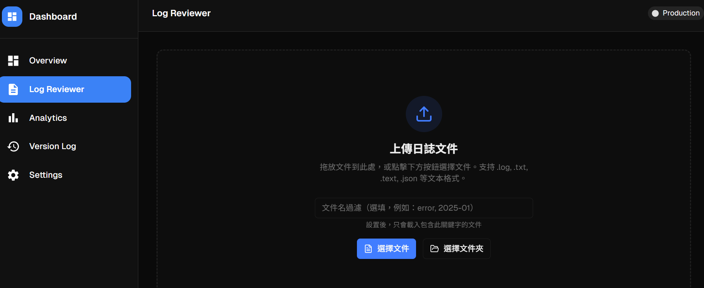
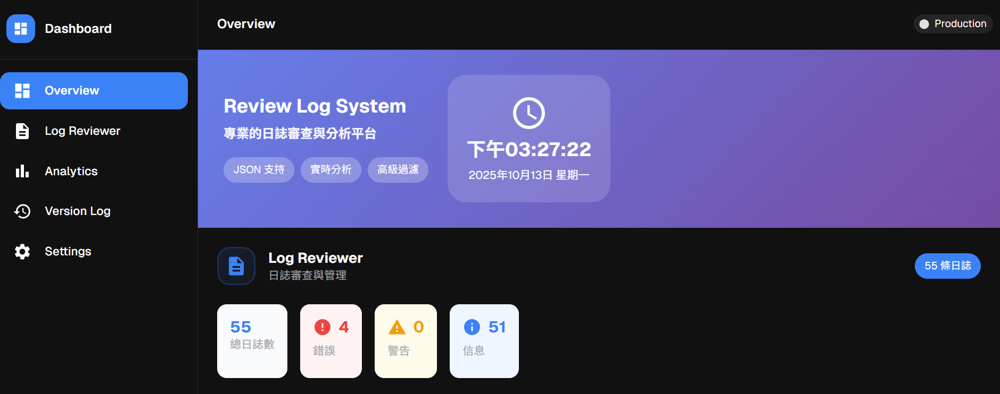
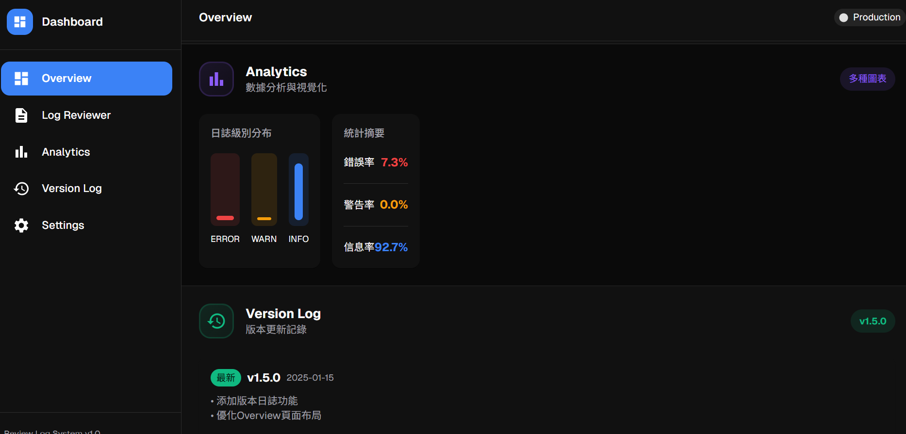
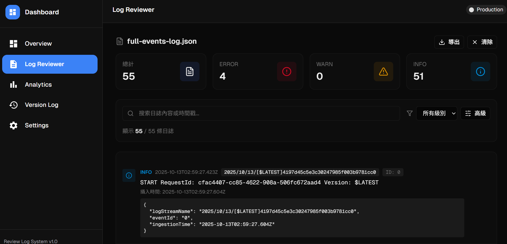
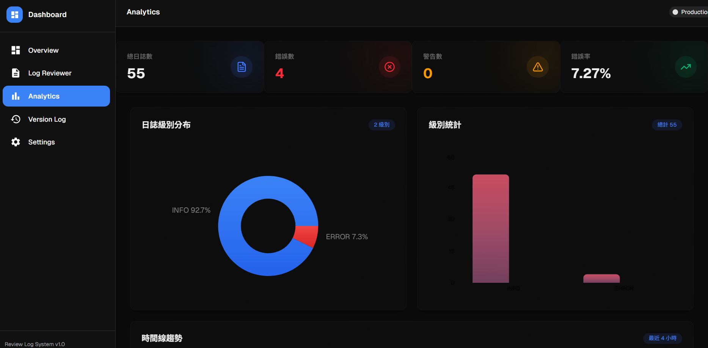
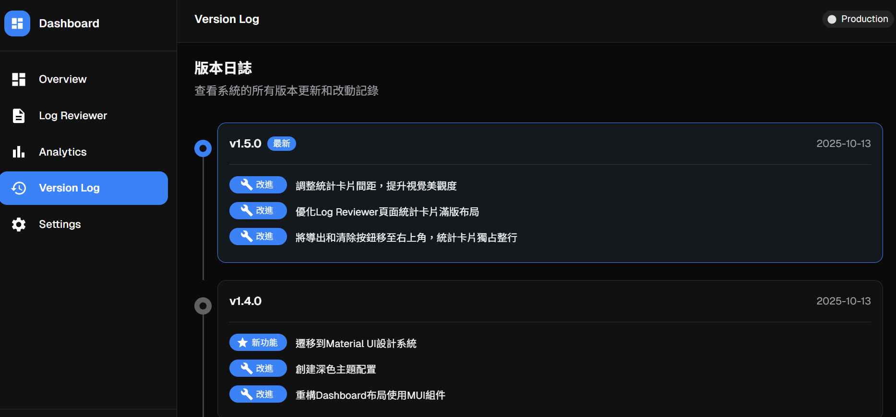
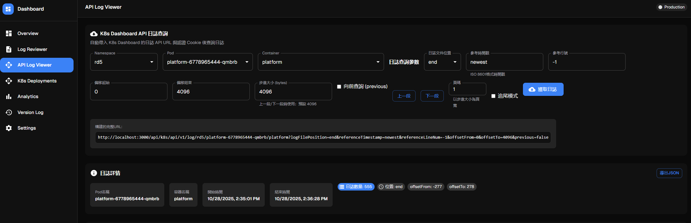
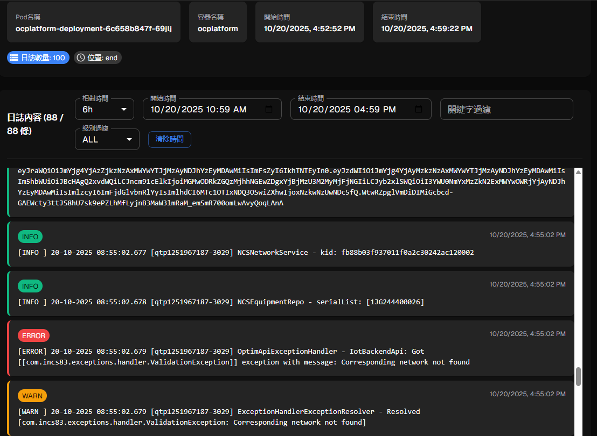
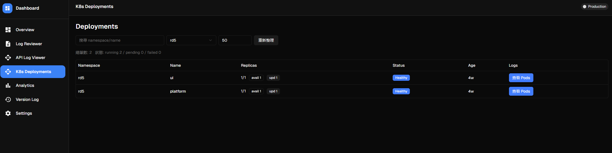
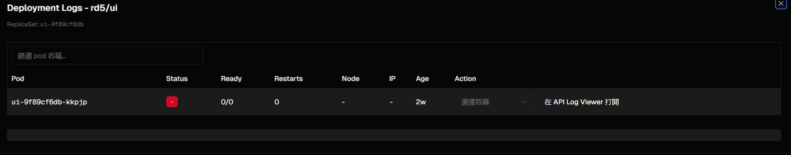

[English](./README.md) | [繁體中文](./README.zh-TW.md)

# 🪶 aws-log-reviewer

`aws-log-reviewer` is a tool to **preview AWS CloudWatch Logs locally**.  
It uses `awslocal logs filter-log-events` to fetch logs from LocalStack, exports the results, and displays them in a web UI so you can quickly inspect logs from Lambda or other AWS services.

---

## 🚀 Features

- 🧾 One-click fetch of CloudWatch Logs from LocalStack  
- 📂 Export logs to a JSON file  
- 💻 Intuitive web UI for fast browsing and search  
- 🕵️ Filter and categorize logs across multiple services  
- ☸️ K8s Dashboard API log viewer with real-time log streaming  
- 📊 Analytics dashboard with charts and statistics  

---

## 🧩 Architecture

```text
+--------------------+
|   LocalStack AWS   |
| (CloudWatch Logs)  |
+---------+----------+
          |
          | awslocal logs filter-log-events
          v
+--------------------+
|  aws-log-reviewer  |
|  (Log Fetcher)     |
+---------+----------+
          |
          | JSON Log File
          v
+--------------------+
|   Web UI Viewer    |
+--------------------+
```

🧰 Tech Stack

Backend: LocalStack, AWS CLI (awslocal)

Frontend: React / Vite (visual UI)

Log Format: JSON-based log parsing

---

🧭 Usage
1️⃣ Fetch logs
Use awslocal to fetch all CloudWatch logs from LocalStack and export to a file:

```
awslocal logs filter-log-events ^
--log-group-name /aws/lambda/your-function ^
--limit 1000 > result/log/full-events-log.json
```
Demo file: /data/full-events-log.json

2️⃣ Start the Log Review UI
Start the frontend UI and browse the log file content:

```
npm i

npm run build

npm run start
```

After startup, open your browser at:
👉 http://localhost:3000

Then import the `full-events-log.json` file in the UI.

## 📄 Available Pages

The application includes the following pages:

- **Overview**: Dashboard overview with log statistics and recent updates
- **Log Reviewer**: Main log viewing interface with advanced filtering and search
- **API Log Viewer**: K8s Dashboard API log viewer with real-time streaming, namespace/pod/container selection, and time range filtering
- **K8s Deployments**: View Kubernetes deployments, pods, and container logs
- **Analytics**: Data analysis dashboard with charts and statistics
- **Version Log**: Application version history and changelog

📸 Screenshots



















